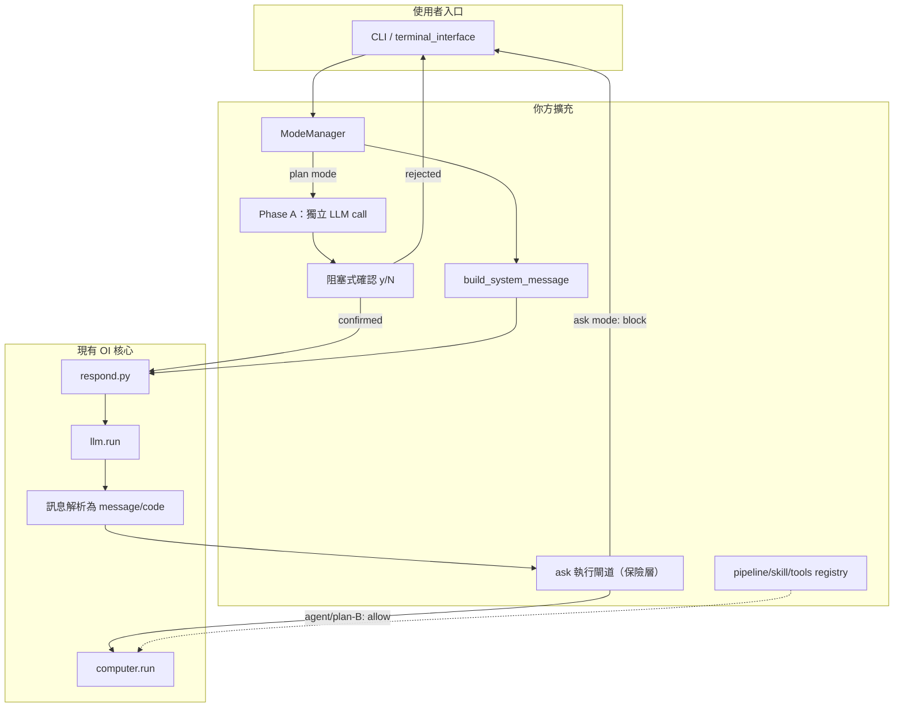

# Open Interpreter 三模式（ask / agent / plan）— 總體計畫

> 本文件由專案計畫整理而來，作為實作與部署的單一參考。  
> 技術基底：`open-interpreter-yc`（fork）。

---

## 實作待辦（Checklist）

- [ ] 定義 `mode`（ask/agent/plan）與 plan 子狀態；設定來源（CLI、環境變數或 magic command）、`OpenInterpreter` 欄位與預設值
- [ ] 建立 `ModeManager` 薄 wrapper（`interpreter/core/mode_manager.py`）；`respond.py` 只留呼叫點，不寫 mode 條件分支
- [ ] 抽離 `build_system_message(mode, phase)`；**ask 模式的 system prompt 必須明確禁止輸出可執行程式碼**（第一道防線）
- [ ] 在 `respond` 路徑「解析出 code 之後、`computer.run` 之前」實作 **ask 硬擋**（第二道防線，保險用）
- [ ] 釐清 registry 與現有 `interpreter/core/computer/skills/skills.py` 的關係（擴充 or 另立）；設計白名單契約與呼叫協議；**不集中託管技能庫**
- [ ] 實作 plan：**Phase A 使用獨立 LLM call**（不走 `respond()` 執行路徑）→ **阻塞式人類確認**（`y/N`）→ Phase B 複用 agent 路徑
- [ ] 定義所有失敗回退行為（skill 不在 registry、Phase B 中途失敗、registry 路徑不存在）
- [ ] 模式切換 UX：切換時顯示警告 + 提供清空 history 選項；telemetry／敏感資料、超時、除錯 trace 等 NFR 收斂

---

## 1. 總整理（我們要達成什麼）

**技術基底**：繼續基於 **open-interpreter-yc**（fork），理由是其已整合 **LiteLLM、終端介面、`respond` 迴圈、將模型輸出解析為 code 並 `computer.run`**；要「跑命令／管線」時，改這條路比從零接 subprocess + 對話狀態省工。若未來產品極簡、只要固定 CLI，可再抽離；目前方向是 **OI + 你方 orchestration**。

**三種模式（產品行為）**：

| 模式 | 行為 |
|------|------|
| **ask** | 單純問答；**不執行任何程式**、不跑終端指令 |
| **agent** | 可執行程式；可調用 **pipeline、skill、tools**（白名單） |
| **plan** | **先規劃再執行**；執行段與 agent **同一套**，外加規劃階段與（已拍板）執行前確認 |

**關鍵設計**：

1. **進 LLM 之前**加一層：依 `mode`（與 plan 的階段）決定 **`system_message`／`custom_instructions`**，不要只靠 prompt。
2. **ask 防線為雙層**：
   - **第一層（主）**：ask 模式 system prompt 明確禁止 LLM 輸出可執行程式碼；若 LLM 遵守，根本不會到執行層。
   - **第二層（保險）**：在 **解析為 `type == "code"` 之後、`computer.run` 之前**硬擋，確保零執行。兩層互補，不可只做其中一層。
3. **plan**：**Phase A** 使用獨立 LLM call（不走 `respond()` 的 code 執行路徑）僅產出計畫文字；**阻塞式確認**後才進 Phase B；Phase B 與 **agent** 共用執行路徑。

**與 `computer_use`（`--os`）**：為 Anthropic Computer Use + 桌面自動化，與三模式 **正交**；不做 GUI 級操控時第一階段可不納入。

---

## 2. 架構（資料流）



- **`ModeManager`**：集中所有 mode 邏輯的薄 wrapper（新增 `interpreter/core/mode_manager.py`）；`respond.py` 只留呼叫點，不在核心寫 mode 條件分支，減少與上游的 diff 面積。
- **`build_system_message`**：ask 模式 prompt 需包含「禁止輸出可執行程式碼」的明確指示；是第一道防線，不只是輔助。
- **`ask 執行閘道`**：緊貼「已判定為可執行程式碼」之後作為保險；與 system prompt 層互補。
- **Phase A 獨立 LLM call**：不走 `respond()` 的 code 執行路徑，避免需要在迴圈內加狀態旗標來阻止執行；回傳純文字計畫後阻塞等待確認。
- **registry**：技能掃描來源為 **使用者本機路徑**（見 §7），**不做**全公司單一集中技能庫；分享時以 zip／git 各使用者自行放入本機目錄即可。

---

## 3. 主要修改點（檔案層級）

| 區域 | 檔案／位置 | 說明 |
|------|------------|------|
| 狀態 | [`interpreter/core/core.py`](../interpreter/core/core.py) | `OpenInterpreter` 新增 `mode` 欄位與預設值（ask/agent/plan） |
| 薄 wrapper | `interpreter/core/mode_manager.py`（新增） | 集中所有 mode 邏輯；`respond.py` 只呼叫此模組 |
| 迴圈 | [`interpreter/core/respond.py`](../interpreter/core/respond.py) | 只留 `ModeManager` 呼叫點；ask 閘道（保險層）；不寫 mode 條件分支 |
| 預設人設 | [`interpreter/core/default_system_message.py`](../interpreter/core/default_system_message.py) | 拆或覆寫為 ask／agent 基底；ask 版本需明確禁止程式碼輸出 |
| 入口 | `interpreter/terminal_interface/start_terminal_interface.py`（及 magic commands） | CLI 旗標或 `%mode` 類指令；切換時顯示警告與 history 選項 |
| registry | `interpreter/core/tool_registry.py`（新增） | 見 §6 registry 設計 |

---

## 4. Skills Registry 與現有 Skills 系統的關係（需拍板）

現有程式碼已有 `interpreter/core/computer/skills/skills.py`（`Skills` class），提供 `list()`、`search()`、`new_skill.create()` 方法，由 `import_skills=True` 啟用。

**本專案 registry 需明確選擇以下其中一條路：**

| 選項 | 說明 | 適用時機 |
|------|------|---------|
| **A. 擴充現有 Skills** | 在 `Skills` class 上加白名單過濾與呼叫協議 | 現有 skills 格式已夠用，只需加管控 |
| **B. 另立 ToolRegistry** | 新增 `tool_registry.py`，定義自己的格式與 schema | 需要 structured tool_use schema（見下）或格式差異太大 |

**推薦方向（B）**：把每個 skill 定義為結構化 **tool_use schema**（參考 Claude API tools 格式），讓 LLM 以結構化呼叫觸發技能而非自由寫程式碼。優點：
- 參數型別安全，不需解析 LLM 自由輸出的程式碼
- 易於 audit log（每次呼叫都有結構化紀錄）
- 白名單等同 schema 清單，管理簡單

skill 定義格式依腳本類型分兩種，loader 統一轉成相同的 tool_use schema 格式：

**類型 A：`.py` skill**（主流做法）  
Schema 直接從函式 type hints + docstring 自動轉換，不需額外檔案。附一份 `.md` 供人閱讀即可。

```python
# skills/send_report.py
def send_report(recipient: str, date_range: str) -> str:
    """
    產生並寄送報表

    Args:
        recipient: 收件人 email
        date_range: 日期範圍，例如 2024-01-01 to 2024-01-31
    """
    ...
```

**類型 B：`.ps1` / `.bat` skill**（Windows shell 腳本）  
Shell 腳本無法內嵌型別資訊，改用 **`.md` + YAML frontmatter** 提供 schema；loader 解析 frontmatter 轉成 tool_use schema，Markdown body 供人閱讀。

```markdown
---
name: send_report
description: 產生並寄送報表
parameters:
  type: object
  properties:
    recipient: { type: string }
    date_range: { type: string }
  required: [recipient, date_range]
entrypoint: send_report.ps1
---

## 說明
產生指定日期範圍的報表並寄給收件人。

## 範例
傳送本週報表給 alice@company.com
```

Loader 判斷邏輯：掃描目錄時，若找到 `.py` 則走 type hints 路徑；若找到 `.md`（含 frontmatter `entrypoint`）則走 YAML frontmatter 路徑。兩條路最終輸出相同的 schema 結構。

---

## 5. Plan 狀態機詳細設計

```
使用者輸入（plan 模式）
  │
  ▼
[Phase A] 獨立 LLM call
  - system prompt：「你只產出執行計畫，不執行任何動作」
  - 輸入：使用者請求 + 目前 context
  - 輸出：純文字計畫（步驟清單）
  - 不走 respond() 迴圈，不觸發 computer.run
  │
  ▼
顯示計畫給使用者
  │
  ▼
[阻塞式確認] > 確認執行？(y/N/edit)
  ├─ N → 回到輸入，不執行
  ├─ edit → 讓使用者修改計畫文字後重新確認
  └─ y → 進入 Phase B
  │
  ▼
[Phase B] 複用 agent 路徑（respond() + computer.run）
  - 將 Phase A 產出的計畫文字注入 context（作為 system instruction）
  - LLM 依計畫逐步執行
  │
  ▼
Phase B 中途失敗處理（見 §8）
```

**Phase A LLM call 實作要點**：
- 直接呼叫 `interpreter.llm.run(messages)` 一次，不進入 respond() 的 yield 迴圈
- system prompt 明確說明「純規劃模式，禁止輸出任何 code block 或 shell 指令」
- 輸出為純文字，不需解析 type

---

## 6. 拍板決策

### pipeline/skill 形態

採結構化 schema（見 §4 推薦方向 B）。格式依腳本類型分兩條路：**`.py` skill** 以 type hints + docstring 自動轉換（Python 生態慣例，不需額外 schema 檔）；**`.ps1`／`.bat` skill** 以 `.md` + YAML frontmatter 提供 schema（shell 腳本無法內嵌型別資訊）。Loader 統一轉成相同的 tool_use schema 格式提供給 LLM。

### plan 確認

**是**——預設一律先確認再執行 Phase B。確認選項：`y`（執行）、`N`（取消）、`edit`（修改計畫後重確認）。

### agent 安全模型（已拍板）

| 選項 | 說明 |
|------|------|
| A. OI 全能力 | 任意 Python／Shell，彈性最大、風險最大 |
| B. registry 為主 | 以登記之 pipeline／skill 為主 |

**本專案採 B**，並允許 **shell 僅在白名單內**執行（政策／registry 層實作）。若日後需要任意程式碼，可選 **進階 flag**（未強制）。

---

## 7. 部署與日常使用（已拍板）

**環境**：**Windows 內網**（API／proxy 由 IT 定）；假設 **cmd／PowerShell** 與 OI 一致。

**技能存放**：

- **不集中託管**：不以全公司單一檔案伺服器即時掛載為前提。
- 每人本機路徑（例：`%USERPROFILE%\.<產品名>\skills` 或安裝目錄下可寫的 `skills\`）。
- 路徑以 `pathlib.Path` 處理並展開 `%USERPROFILE%`，確保 Windows 相容。
- 啟動時掃描 **一或多個本機路徑**（環境變數或設定檔，如 `SKILLS_PATH`；可加 `./skills`）。
- registry 路徑不存在時：**靜默略過並記 warning**，不 crash；顯示「目前無可用技能」提示。
- 分享：wiki／zip／git，由使用者**自行**放到自己的 skills 目錄。

**交付方式（擇一）**：內部 PyPI／wheel + pip；zip + venv + `install.bat`；零 Python 需求時再考慮 PyInstaller。

**日常使用**：捷徑或 `.bat` 啟動固定模式；各人維護本機技能夾。

---

## 8. 失敗回退行為（需明確定義）

| 失敗場景 | 行為 |
|----------|------|
| Agent 呼叫不在 registry 的 skill | 拒絕執行；LLM 回覆「該技能未登記，請確認技能名稱或新增至 skills 目錄」 |
| Plan Phase B 中途失敗（腳本錯誤） | 停止後續步驟；顯示失敗步驟與錯誤訊息；提示使用者「重新規劃 / 手動處理 / 略過此步驟」 |
| Registry 掃描路徑不存在或空目錄 | 靜默略過，記 warning；agent 模式提示「目前無可用技能，僅限 shell 白名單」 |
| Ask 模式硬擋觸發（第二層防線被觸發） | 不執行；顯示程式碼內容但標示「ask 模式不執行」；**同時記錄 warning**（代表 system prompt 第一層防線失效，需檢查） |
| LLM timeout | 顯示 timeout 提示；plan Phase A timeout 不進入 Phase B |
| 使用者 Ctrl+C 中斷 Phase B | 停止目前步驟；不繼續後續步驟；顯示已完成步驟清單 |

---

## 9. 模式切換 UX 設計

**切換行為**：

- 使用者以 `%mode ask`／`%mode agent`／`%mode plan` 或 CLI 旗標切換。
- 切換時**顯示警告**：「目前對話 history 將保留，切換至 [新模式] 後 LLM 可讀取過去的對話內容。」
- 提供選項：`[k] 保留 history` 或 `[c] 清空 history 後切換`（預設 k）。
- Prompt 列顯示目前模式，例如 `[ask] >` / `[agent] >` / `[plan] >`。

**原因**：ask → agent 切換時，歷史 context 可能導致 LLM 主動觸發先前對話提到的操作，需讓使用者意識到此風險。

---

## 10. 非功能需求（NFR）

- **模式可見性**：使用者需清楚目前為 ask／agent／plan（啟動參數、提示列或指令切換）。
- **同對話切模式**：切換時顯示警告 + 提供清空 history 選項（見 §9）；不靜默切換。
- **plan 確認**：**已拍板**——規劃印出後**一律**需使用者確認才進入 Phase B（`y`／`N`／`edit`）。
- **安全**：registry 白名單、危險操作標記、金鑰不進入可上傳的 conversation（視 telemetry 開關）。
- **可靠性**：子程序／pipeline **timeout**、**Ctrl+C**、plan 失敗時中止並提示（見 §8）。
- **Windows**：路徑統一以 `pathlib.Path` 處理；shell 執行以 PowerShell 為主，與 OI 既有行為對齊。
- **成本**：plan 多一輪 LLM（Phase A）、loop 多輪；可選預算上限（litellm）。
- **可維護性**：新邏輯收斂在 `ModeManager` 與 `ToolRegistry`，`respond.py` 只留呼叫點；減少與上游 diff 面積。
- **本機技能、無集中庫**：registry 僅讀本機目錄（可多路徑）；不強制內網檔案伺服器「唯一技能庫」同步。

---

## 11. 建議實作順序

1. **`ModeManager` 骨架** + `mode` 欄位 + `build_system_message`（ask 版本含禁止執行指令）。
2. **ask 雙層防線**：先確認 system prompt 有效（LLM 不產出 code），再加硬擋保險。
3. **`ToolRegistry`**（決定與現有 Skills 的關係後）：schema 載入、白名單、呼叫協議。
4. **agent + registry 整合**：LLM structured tool call → registry 查找 → 執行。
5. **plan orchestrator**：Phase A 獨立 LLM call → 阻塞確認 → Phase B。
6. **UX／NFR 收斂**：模式切換警告、失敗回退、timeout、Windows 路徑。

---

## 12. 下一步

於 Cursor 使用 **Agent 模式**依本計畫實作；建議小步提交（先 ModeManager 骨架 → ask 防線 → registry → plan）。

**實作前需確認的拍板項目**：
- [ ] Skills registry 採擴充現有 `Skills` class（選項 A）或另立 `ToolRegistry`（選項 B，推薦）？
- [ ] Plan Phase B 失敗時：中止所有後續步驟，還是讓使用者選擇略過此步繼續？
